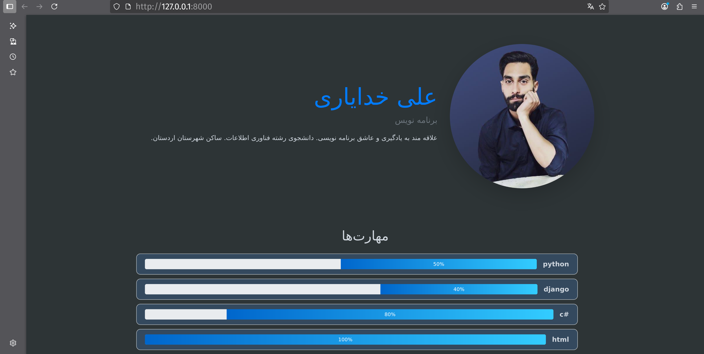

# 📝 Online Resume Builder (رزومه‌ساز آنلاین)

یک وب‌اپلیکیشن تحت وب با Django برای ساخت و مدیریت رزومه آنلاین.  
کاربران می‌توانند اطلاعات شخصی، تحصیلی و کاری خود را وارد کنند و رزومه‌ی نهایی را در قالبی ساده و خوانا مشاهده کنند.

---

## 🚀 امکانات
- ثبت اطلاعات فردی، تحصیلی و شغلی
- مدیریت اطلاعات از طریق پنل Django Admin
- تولید رزومه در قالب ساده و تمیز
- پیاده‌سازی با Django و SQLite (پیش‌فرض)

---

## ⚙️ نصب و اجرا

### 1 کلون کردن پروژه
```bash
git clone https://github.com/username/online-resume-builder.git
cd online-resume-builder


2- ساخت محیط مجازی و نصب پکیج‌ها

python -m venv venv
source venv/bin/activate   # در لینوکس / مک
venv\Scripts\activate      # در ویندوز

pip install -r requirements.txt

3- اجرای مایگریشن‌ها (راه‌اندازی دیتابیس)

python manage.py migrate

4- اجرای سرور

python manage.py runserver

اکنون برنامه در مرورگر روی آدرس زیر در دسترس است:
👉 http://127.0.0.1:8000


📂 ساختار پروژه
online-resume-builder/
│── manage.py
│── requirements.txt
│── app_name/
│   ├── models.py
│   ├── views.py
│   ├── templates/
│   └── ...
└── ...

📸 پیش‌نمایش



🤝 مشارکت
از پیشنهاد های شما استقبال میکنم 🙌